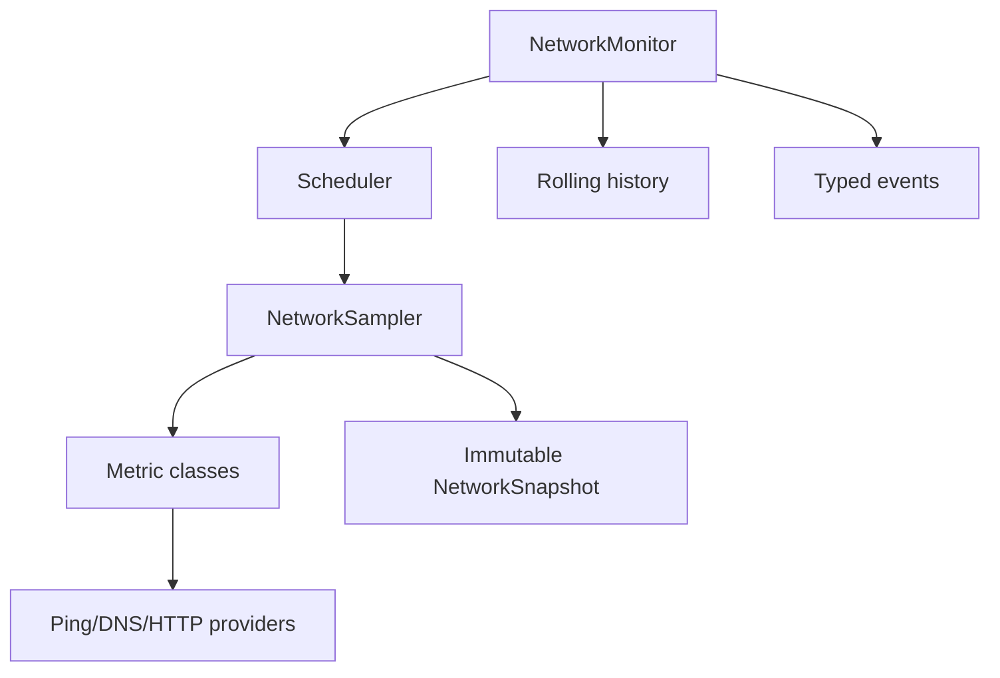
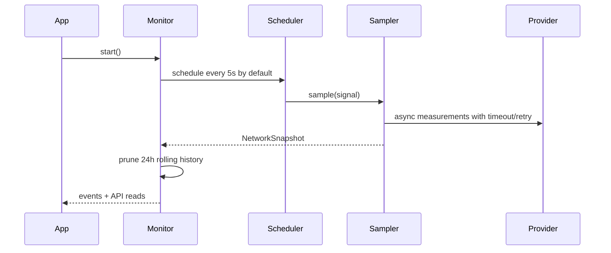

# Network Intelligence Core

## Architecture

`@irp/network-intelligence` is a TypeScript strict-mode package that continuously measures network quality without changing VPN, proxy, DNS, or UI state.



## Sampling flow



## Metrics

Each snapshot includes latency, jitter, packet loss, DNS lookup time, HTTP response time, HTTPS handshake time, IPv4/IPv6 connectivity, public IP, ASN, ISP, network type, gateway reachability, internet reachability, bandwidth, quality score, and timestamp.

## API

```ts
import { NetworkMonitor, NetworkSampler, NodeDNSProvider, NodeHTTPProvider, MockablePingProvider } from '@irp/network-intelligence';

const sampler = new NetworkSampler({
  ping: new MockablePingProvider(),
  dns: new NodeDNSProvider(),
  http: new NodeHTTPProvider(),
});
const monitor = new NetworkMonitor(sampler);
monitor.subscribe('quality.changed', (event) => console.log(event.current));
monitor.start();

const latest = monitor.snapshot();
const fiveMinutes = monitor.history('5m');
const health = monitor.health();
monitor.stop();
```

### Methods

- `start()` begins periodic sampling.
- `stop()` aborts active work and cancels scheduling.
- `snapshot()` returns the newest immutable `NetworkSnapshot`.
- `history(window)` returns samples for `1m`, `5m`, `30m`, or `24h`.
- `subscribe(event, handler)` registers a strongly typed listener.
- `unsubscribe(event, handler)` removes a listener.
- `health()` reports running state, sample count, and latest snapshot.

## Quality algorithm

The deterministic score is clamped to `0..100` and combines weighted sub-scores:

| Metric | Weight |
| --- | ---: |
| Latency | 20% |
| Packet loss | 25% |
| Jitter | 15% |
| DNS | 10% |
| HTTP | 10% |
| Bandwidth | 10% |
| Reachability | 10% |

Lower latency, jitter, DNS, and HTTP timings score better. Packet loss decreases linearly up to complete loss. Bandwidth reaches full credit at 25 Mbps. Reachability combines internet, gateway, IPv4, and IPv6 evidence.

## Extension guide

Implement provider interfaces to integrate platform-native probes or test doubles:

- `PingProvider` for latency, jitter, packet loss, and gateway checks.
- `DNSProvider` for resolver timing.
- `HTTPProvider` for HTTP, TLS, public IP, ASN, ISP, and bandwidth estimation.

All provider methods are asynchronous, receive an `AbortSignal`, and are called through retry and timeout protection by `NetworkSampler`.
