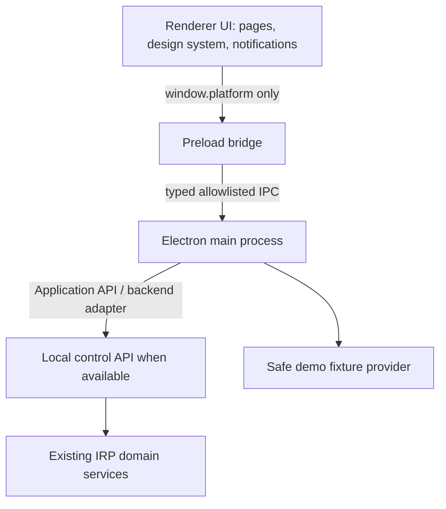

# Phase 20 Desktop Architecture

Electron is a client. The renderer cannot access Node.js, `ipcRenderer`, filesystem, shell, or privileged commands. Main owns lifecycle, IPC registration, CSP, navigation protection, logging, diagnostics, and backend/demo data-source selection. Preload exposes explicit namespaced APIs only. IPC contracts live in `apps/desktop/src/shared/ipc-contracts.ts` and each channel has a validator and error model.

The current implementation uses the demo provider when the local backend/control API is unavailable. Demo data is marked `DEMO`; missing live backend state is reported as unavailable rather than faked. Future backend integration should replace the demo provider behind the same typed application API without moving network/routing/DNS/tunnel/security/AI logic into Electron.
